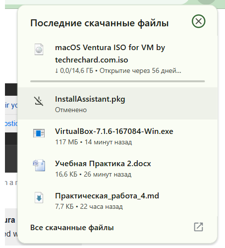
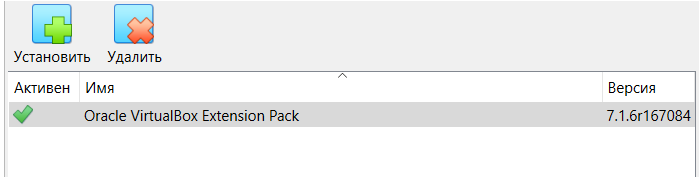
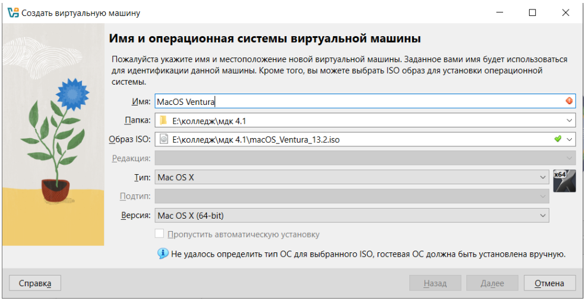
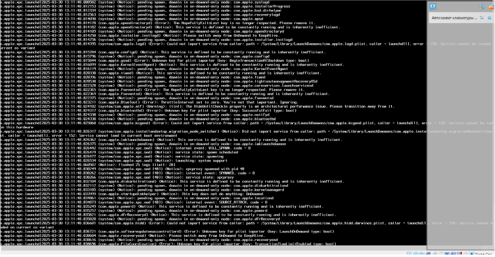
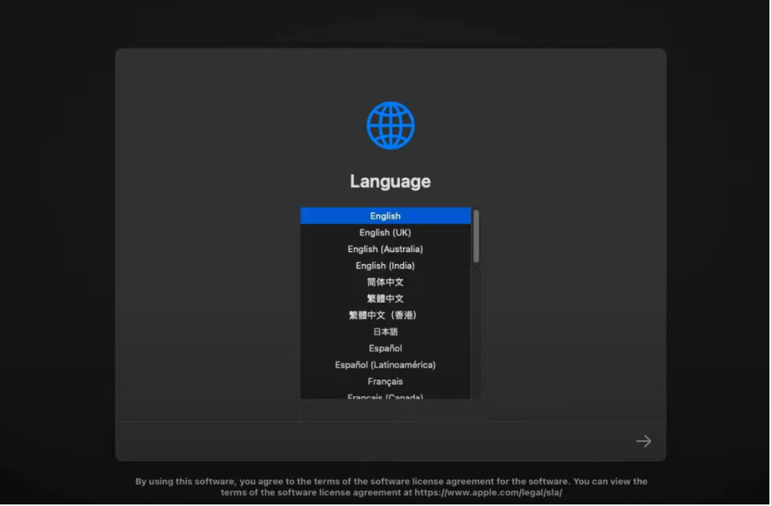
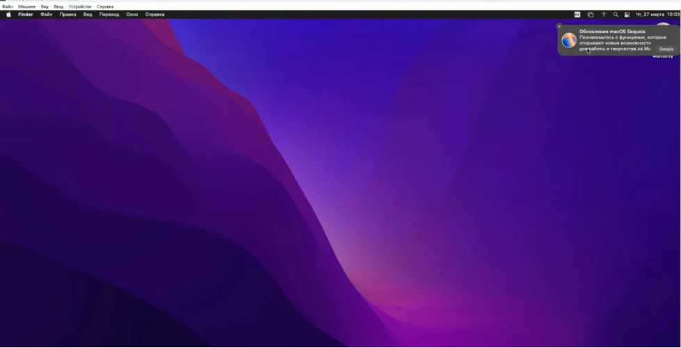

# praktika2
# Отчет по учебной практике
**Цель**: Ознакомиться с процессом загрузки и установки программного обеспечения на различных операционных системах, таких как macOS и Linux.
### Задание: Установка macOSVentura
#### 1. Скачивание установщика macOS Ventura
* 
#### Дополнительно установлен плагин для VittualBox
* 
#### 2. Настройка виртуальной машины
* 
#### Виртуальная машина была запущена, и началась установка macOS Ventura
* 
#### Следуя инструкциям на экране, была успешно завершена установка операционной системы на виртуальную машину.
* 
* 
### Заключение
Практика по установке macOS Ventura на виртуальную машину была успешно выполнена. Были получены навыки работы с операционной системой macOS в виртуальной среде, установки и настройки программного обеспечения, а также решения возникающих проблем.
